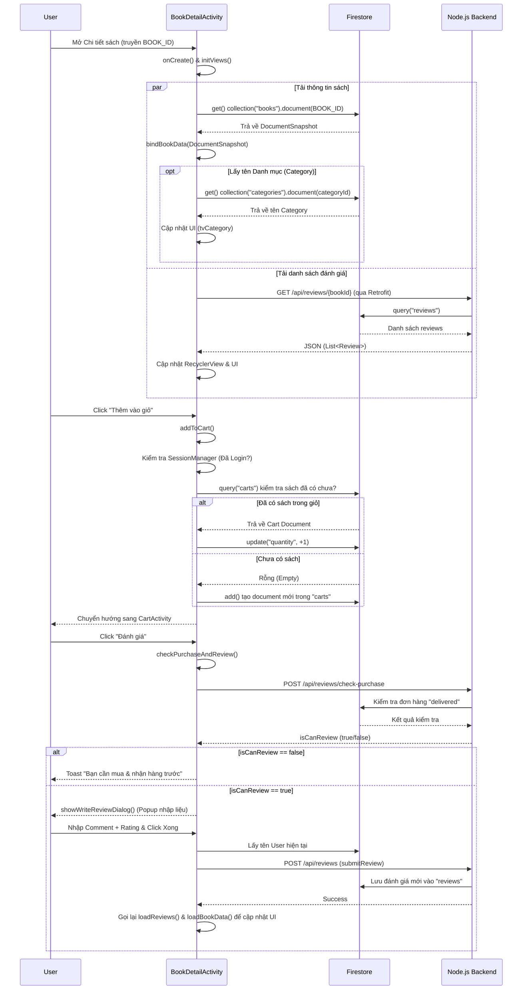

# Tài liệu Kỹ thuật: Luồng Chi Tiết Sản Phẩm (BookDetailActivity)

Trong tài liệu này, tôi sẽ giải thích cặn kẽ flow hoạt động, các hàm cốt lõi, cách chúng tương tác với nhau, và cung cấp một sơ đồ Sequence Diagram (Mermaid) chuẩn xác theo mã nguồn `BookDetailActivity.java`.

## 1. Tổng quan Luồng hoạt động (Flow)

Khi người dùng bấm vào một cuốn sách từ `HomeActivity` (hoặc các màn hình danh sách khác), một Intent được gửi đến `BookDetailActivity` kèm theo ID của cuốn sách (`BOOK_ID`). Từ đây, ứng dụng thực hiện các bước sau:
1. **Khởi tạo Giao diện:** Ánh xạ các UI Component (TextView, Button, RecyclerView...).
2. **Tải thông tin sách:** Gọi trực tiếp xuống Firestore để lấy thông tin chi tiết của sách (tên, tác giả, giá, mô tả, số lượng tồn...).
3. **Hiển thị Danh mục (Category):** Truy vấn thêm một lần nữa vào bảng `categories` trên Firestore để lấy tên danh mục dựa trên `categoryId` của sách.
4. **Tải Đánh giá (Reviews):** Gọi qua Node.js Backend thông qua thư viện **Retrofit** để lấy danh sách đánh giá mới nhất.
5. **Thêm vào Giỏ hàng:** Xử lý ghi trực tiếp dữ liệu vào bảng `carts` trên Firestore.
6. **Viết Đánh giá:** Giao tiếp qua Node.js để kiểm tra quyền đánh giá (đã mua & nhận hàng chưa), sau đó mở Dialog và submit đánh giá lên server.

---

## 2. Phân tích chi tiết từng hàm và dòng code

### 2.1. Khởi tạo và Nhận dữ liệu (`onCreate` & `initViews`)
Hàm `onCreate` là điểm bắt đầu.
- **Dòng code quan trọng:** 
  ```java
  String bookIdStr = getIntent().getStringExtra("BOOK_ID");
  ```
  Nhận ID của sách được truyền từ màn hình trước. 
- Sau đó, ứng dụng gọi hai hàm bất đồng bộ song song:
  ```java
  loadBookData(currentBookId); // Tải thông tin cơ bản
  loadReviews(currentBookId);  // Tải danh sách đánh giá
  ```

### 2.2. Tải và Bind dữ liệu sách (`loadBookData` & `bindBookData`)
- **`loadBookData(String bookId)`:** 
  Sử dụng Firestore SDK để query trực tiếp Document theo ID:
  ```java
  FirebaseFirestore.getInstance().collection("books").document(bookId).get()
  ```
  Nếu không tìm thấy bằng Document ID, ứng dụng có cơ chế **Fallback** (dự phòng) tìm theo field `bookId` (được code ở hàm này để hỗ trợ cấu trúc database cũ).
  
- **`bindBookData(DocumentSnapshot doc)`:**
  Hàm này trích xuất (extract) các giá trị như `getString("title")`, `getDouble("price")` và set lên các `TextView`.
  **Xử lý Category:** Vì `books` chỉ lưu `categoryId`, hàm này thực hiện truy vấn thêm:
  ```java
  FirebaseFirestore.getInstance().collection("categories").document(categoryName).get()
  ```
  Để lấy trường `name` và hiển thị ra UI.

### 2.3. Tải Đánh Giá (`loadReviews`)
- Chức năng này **KHÔNG** gọi Firestore trực tiếp mà thông qua **Node.js Server** bằng thư viện Retrofit:
  ```java
  ApiService apiService = RetrofitClient.getClient().create(ApiService.class);
  apiService.getReviews(bookId).enqueue(new Callback<...>() { ... })
  ```
- Dữ liệu trả về được đổ vào mảng `reviewList`, sau đó gọi `reviewAdapter.notifyDataSetChanged()` để RecyclerView vẽ lên màn hình. Nếu mảng rỗng, `tvNoReview` (Chưa có đánh giá nào) sẽ được hiển thị.

### 2.4. Thêm vào Giỏ hàng (`addToCart`)
Hàm này thực hiện lưu giỏ hàng trực tiếp lên Firestore mà không qua Node.js.
1. **Kiểm tra đăng nhập:** Qua class `SessionManager`.
2. **Kiểm tra trùng lặp:** 
   ```java
   db.collection("carts").whereEqualTo("userId", uid).whereEqualTo("bookId", currentBookId).get()
   ```
3. **Logic Cập nhật:** 
   - Nếu sách đã có trong giỏ: `update("quantity", newQty)`
   - Nếu chưa có: `db.collection("carts").add(cartData)`
4. Cuối cùng, điều hướng người dùng sang `CartActivity`.

### 2.5. Luồng Đánh Giá (`checkPurchaseAndReview`, `showWriteReviewDialog`, `submitReview`)
Việc đánh giá yêu cầu tính toàn vẹn dữ liệu cao nên đi qua Node.js:
- **Kiểm tra quyền (`checkPurchaseAndReview`):**
  Gọi HTTP POST `/api/reviews/check-purchase`. Node.js sẽ trả về `isCanReview = true` nếu user đã mua và đơn có trạng thái `delivered`.
- **Hiển thị Dialog (`showWriteReviewDialog`):**
  Mở popup lấy Rating và Comment.
- **Submit (`submitReview`):**
  Gọi HTTP POST `/api/reviews`. Node.js lưu vào Firestore. Khi có kết quả thành công, app sẽ tự động gọi lại `loadReviews()` và `loadBookData()` để load lại view (và làm mới điểm rating trung bình).

---

## 3. Mermaid Sequence Diagram

Bạn có thể copy đoạn mã dưới đây paste vào công cụ Mermaid (như Mermaid Live Editor hoặc Obsidian) để render ra sơ đồ flow.


