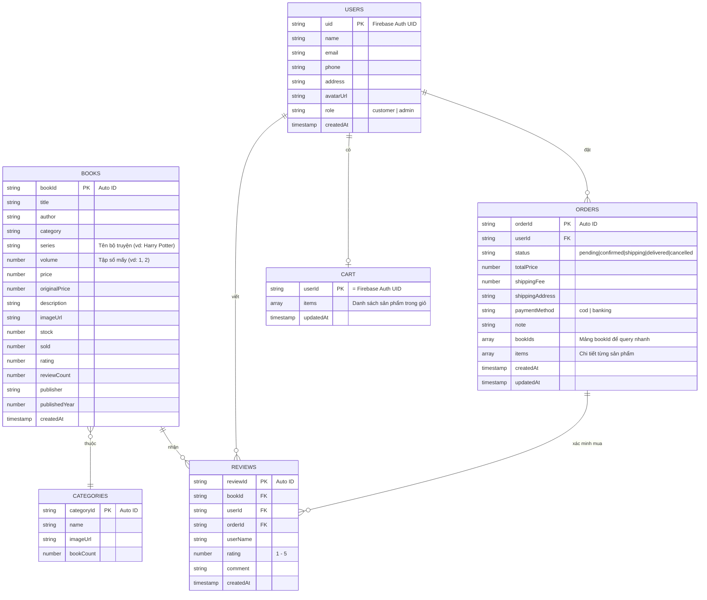

# 📦 BookStore App — Firebase Firestore DB Design

> **Phiên bản:** 1.0 | **Ngày:** 25/06/2026  
> Tài liệu này dùng để thống nhất cấu trúc database giữa các thành viên nhóm.

---

## 🗺️ Sơ đồ quan hệ



---

## 📋 Chi tiết từng Collection

### 🔵 `users`
| Field | Kiểu | Bắt buộc | Mô tả |
|-------|------|----------|-------|
| `uid` | String | ✅ | Firebase Auth UID (dùng làm Document ID) |
| `name` | String | ✅ | Tên hiển thị |
| `email` | String | ✅ | Email đăng nhập |
| `phone` | String | ❌ | Số điện thoại |
| `address` | String | ❌ | Địa chỉ giao hàng mặc định |
| `avatarUrl` | String | ❌ | URL ảnh đại diện (Firebase Storage) |
| `role` | String | ✅ | `"customer"` hoặc `"admin"` |
| `createdAt` | Timestamp | ✅ | Thời gian tạo tài khoản |

**Ví dụ document:**
```json
{
  "name": "Nguyễn Văn A",
  "email": "a@gmail.com",
  "phone": "0901234567",
  "address": "123 Lê Lợi, Quận 1, TP.HCM",
  "avatarUrl": "https://storage.firebase.../avatar.jpg",
  "role": "customer",
  "createdAt": "2026-06-01T10:00:00Z"
}
```

---

### 🟡 `books`
| Field | Kiểu | Bắt buộc | Mô tả |
|-------|------|----------|-------|
| `title` | String | ✅ | Tên sách |
| `author` | String | ✅ | Tên tác giả |
| `category` | String | ✅ | Thể loại (khớp với `categories.name`) |
| `series` | String | ❌ | Tên bộ truyện/series (dùng cho sách nhiều tập) |
| `volume` | Number | ❌ | Tập số mấy (dùng kết hợp với series) |
| `price` | Number | ✅ | Giá bán (VND) |
| `originalPrice` | Number | ❌ | Giá gốc (hiển thị gạch ngang) |
| `description` | String | ✅ | Mô tả nội dung sách |
| `imageUrl` | String | ✅ | URL ảnh bìa (Firebase Storage) |
| `stock` | Number | ✅ | Số lượng tồn kho |
| `sold` | Number | ✅ | Số lượng đã bán (mặc định = 0) |
| `rating` | Number | ✅ | Điểm trung bình (mặc định = 0) |
| `reviewCount` | Number | ✅ | Số lượt đánh giá (mặc định = 0) |
| `publisher` | String | ❌ | Nhà xuất bản |
| `publishedYear` | Number | ❌ | Năm xuất bản |
| `createdAt` | Timestamp | ✅ | Ngày thêm vào hệ thống |

**Ví dụ document:**
```json
{
  "title": "Harry Potter và Hòn Đá Phù Thủy",
  "author": "J.K. Rowling",
  "category": "Văn học",
  "series": "Harry Potter",
  "volume": 1,
  "price": 85000,
  "originalPrice": 120000,
  "description": "Tập đầu tiên của bộ truyện phép thuật nổi tiếng...",
  "imageUrl": "https://storage.firebase.../hp1.jpg",
  "stock": 50,
  "sold": 320,
  "rating": 4.5,
  "reviewCount": 128,
  "publisher": "NXB Trẻ",
  "publishedYear": 2023,
  "createdAt": "2026-06-01T08:00:00Z"
}
```

---

### 🟠 `orders`
| Field | Kiểu | Bắt buộc | Mô tả |
|-------|------|----------|-------|
| `userId` | String | ✅ | UID người đặt hàng |
| `status` | String | ✅ | Trạng thái đơn (xem bên dưới) |
| `totalPrice` | Number | ✅ | Tổng tiền (đã gồm phí ship) |
| `shippingFee` | Number | ✅ | Phí vận chuyển |
| `shippingAddress` | String | ✅ | Địa chỉ giao hàng |
| `paymentMethod` | String | ✅ | `"cod"` hoặc `"banking"` |
| `note` | String | ❌ | Ghi chú của khách |
| `bookIds` | Array\<String\> | ✅ | **Chỉ chứa bookId** — dùng để query "đã mua chưa" |
| `items` | Array\<Object\> | ✅ | Chi tiết sản phẩm (xem bên dưới) |
| `createdAt` | Timestamp | ✅ | Thời gian đặt hàng |
| `updatedAt` | Timestamp | ✅ | Thời gian cập nhật gần nhất |

**Trạng thái đơn hàng:**
```
pending → confirmed → shipping → delivered
                               ↘ cancelled (có thể cancel trước khi shipping)
```

**Cấu trúc `items[]`:**
```json
{
  "bookId": "abc123",
  "title": "Đắc Nhân Tâm",
  "imageUrl": "https://...",
  "price": 85000,
  "quantity": 2
}
```

> ⚠️ **Quan trọng:** Lưu `title` và `price` tại thời điểm mua để tránh bị thay đổi sau.

**Ví dụ document:**
```json
{
  "userId": "user_uid_abc",
  "status": "delivered",
  "totalPrice": 205000,
  "shippingFee": 35000,
  "shippingAddress": "123 Lê Lợi, Quận 1, TP.HCM",
  "paymentMethod": "cod",
  "note": "Giao trước 5h chiều",
  "bookIds": ["bookId_1", "bookId_2"],
  "items": [
    { "bookId": "bookId_1", "title": "Đắc Nhân Tâm", "price": 85000, "quantity": 2, "imageUrl": "..." },
    { "bookId": "bookId_2", "title": "Nhà Giả Kim", "price": 79000, "quantity": 1, "imageUrl": "..." }
  ],
  "createdAt": "2026-06-20T14:00:00Z",
  "updatedAt": "2026-06-22T09:00:00Z"
}
```

---

### 🟢 `cart`
| Field | Kiểu | Bắt buộc | Mô tả |
|-------|------|----------|-------|
| Document ID | String | ✅ | = `userId` (mỗi user 1 giỏ duy nhất) |
| `items` | Array\<Object\> | ✅ | Danh sách sản phẩm trong giỏ |
| `updatedAt` | Timestamp | ✅ | Lần cập nhật gần nhất |

**Cấu trúc `items[]`:**
```json
{
  "bookId": "abc123",
  "title": "Đắc Nhân Tâm",
  "imageUrl": "https://...",
  "price": 85000,
  "quantity": 1
}
```

---

### 🔴 `reviews`
| Field | Kiểu | Bắt buộc | Mô tả |
|-------|------|----------|-------|
| `bookId` | String | ✅ | ID sách được đánh giá |
| `userId` | String | ✅ | UID người đánh giá |
| `orderId` | String | ✅ | ID đơn hàng xác minh đã mua |
| `userName` | String | ✅ | Tên hiển thị (lưu lại để load nhanh) |
| `rating` | Number | ✅ | Số sao từ 1 đến 5 |
| `comment` | String | ✅ | Nội dung bình luận |
| `createdAt` | Timestamp | ✅ | Thời gian đánh giá |

**Ví dụ document:**
```json
{
  "bookId": "bookId_1",
  "userId": "user_uid_abc",
  "orderId": "order_xyz",
  "userName": "Nguyễn Văn A",
  "rating": 5,
  "comment": "Sách rất hay, thay đổi cách nhìn của tôi!",
  "createdAt": "2026-06-23T10:00:00Z"
}
```

---

### ⚪ `categories`
| Field | Kiểu | Bắt buộc | Mô tả |
|-------|------|----------|-------|
| `name` | String | ✅ | Tên thể loại |
| `imageUrl` | String | ❌ | Ảnh đại diện thể loại |
| `bookCount` | Number | ✅ | Số lượng sách (mặc định = 0) |

**Danh sách thể loại gợi ý:**
```
Kỹ năng sống | Văn học | Kinh tế | Tâm lý | Thiếu nhi | Lịch sử | Khoa học
```

---

## 🔑 Phân công - Ai dùng collection nào?

| Thành viên | Chức năng | Collections cần |
|-----------|-----------|-----------------|
| **Firebase setup** | Auth, cấu hình | `users` |
| **Bạn** | Chi tiết sách, Đánh giá | `books`, `reviews`, `orders` (chỉ đọc) |
| Thành viên khác | Giỏ hàng | `cart`, `books` (chỉ đọc) |
| Thành viên khác | Đơn hàng | `orders`, `books` (chỉ đọc) |
| Thành viên khác | Admin | Tất cả collections |

---

## ⚙️ Firestore Security Rules (dùng khi dev)

```javascript
// Dán vào Firestore Rules trên Firebase Console
rules_version = '2';
service cloud.firestore {
  match /databases/{database}/documents {

    // Users: chỉ đọc/sửa thông tin của chính mình
    match /users/{userId} {
      allow read, write: if request.auth != null && request.auth.uid == userId;
    }

    // Books: ai cũng đọc được, chỉ admin mới sửa
    match /books/{bookId} {
      allow read: if true;
      allow write: if request.auth != null 
        && get(/databases/$(database)/documents/users/$(request.auth.uid)).data.role == "admin";
    }

    // Orders: chỉ đọc/tạo đơn của chính mình
    match /orders/{orderId} {
      allow read, create: if request.auth != null 
        && request.auth.uid == resource.data.userId;
      allow update: if request.auth != null 
        && get(/databases/$(database)/documents/users/$(request.auth.uid)).data.role == "admin";
    }

    // Cart: chỉ truy cập giỏ hàng của chính mình
    match /cart/{userId} {
      allow read, write: if request.auth != null && request.auth.uid == userId;
    }

    // Reviews: ai cũng đọc, chỉ người có đơn hàng mới viết
    match /reviews/{reviewId} {
      allow read: if true;
      allow create: if request.auth != null;
      allow delete: if request.auth != null 
        && request.auth.uid == resource.data.userId;
    }

    // Categories: ai cũng đọc
    match /categories/{categoryId} {
      allow read: if true;
      allow write: if request.auth != null 
        && get(/databases/$(database)/documents/users/$(request.auth.uid)).data.role == "admin";
    }
  }
}
```

> ⚠️ **Lưu ý:** Trong giai đoạn phát triển, có thể dùng `allow read, write: if true;` cho tất cả để test nhanh. **Nhớ đổi lại trước khi demo.**
