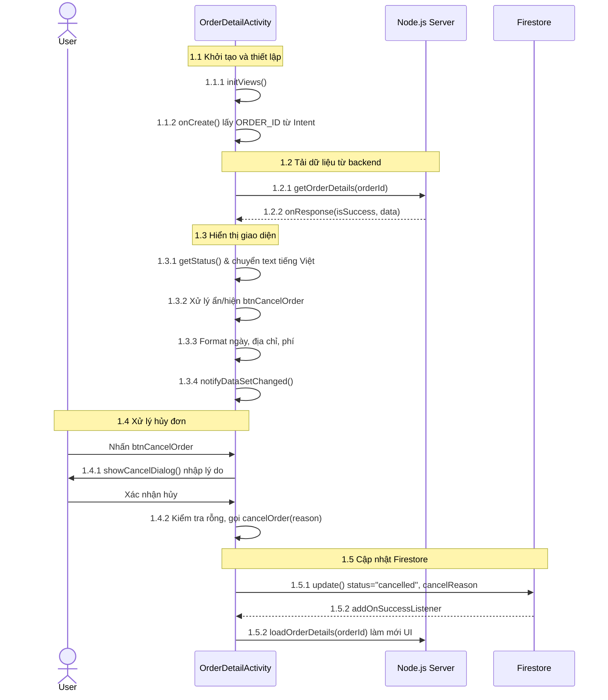
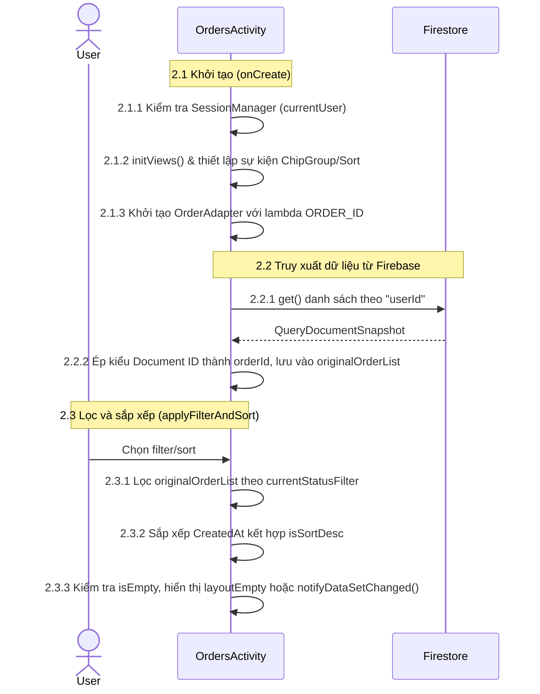
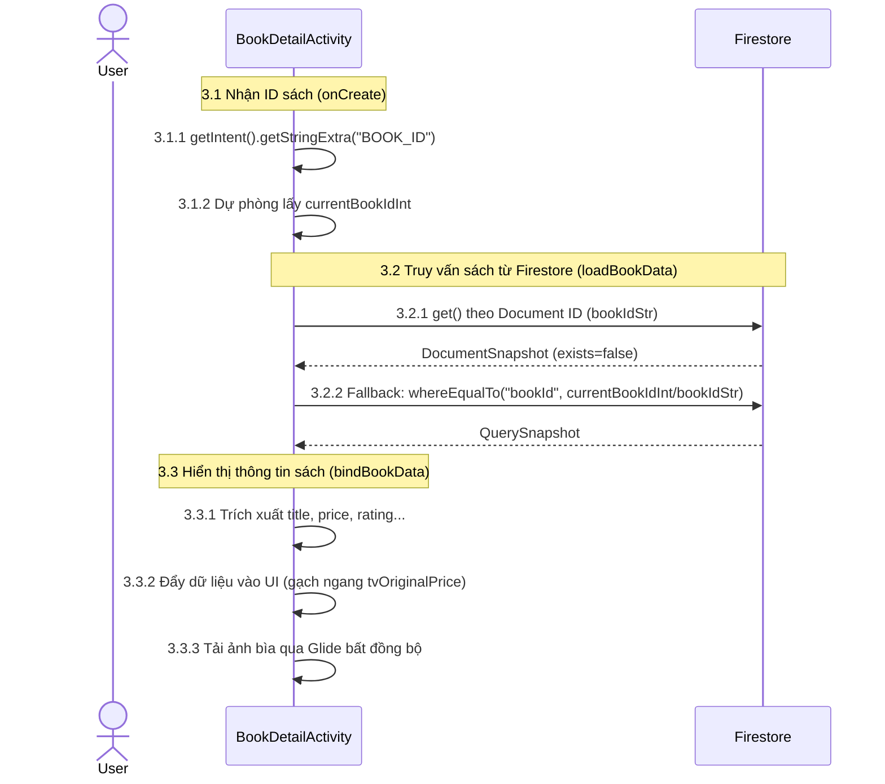
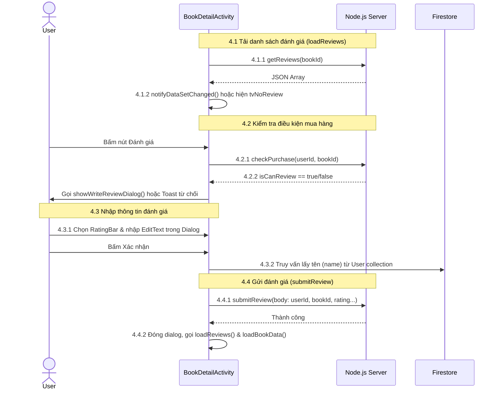
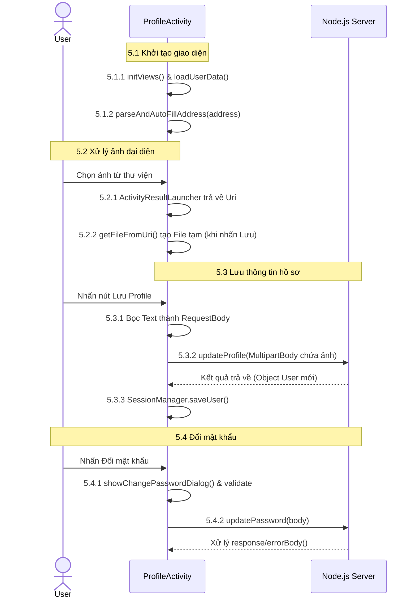
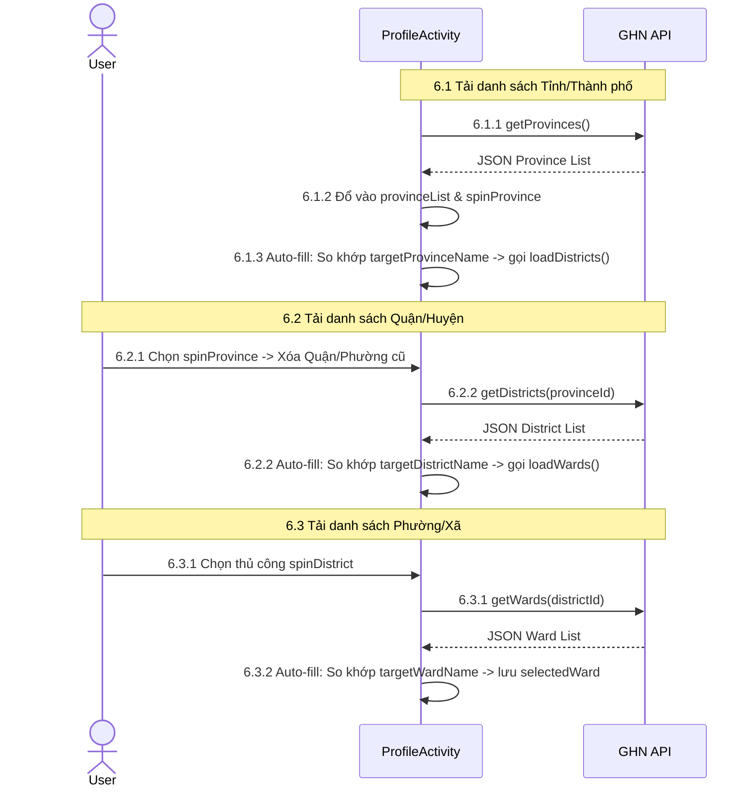

# Sequence Diagrams: Các Chức Năng Của Ứng Dụng Bookstore

Dưới đây là mã Mermaid để vẽ Sequence Diagram (Biểu đồ tuần tự) cho 6 chức năng tương ứng trong `tai_lieu_ky_thuat_chuc_nang.md`. Các mã số chú thích (ví dụ: `1.1.1`, `1.2.1`) đã được gắn trực tiếp vào các thông điệp để bạn dễ dàng tìm kiếm và đối chiếu với mã nguồn.

## 1. Chi Tiết Đơn Hàng (Order Detail)

---

## 2. Đơn Hàng Của Tôi (My Orders)

---

## 3. Chi Tiết Sản Phẩm (Product Detail)

---

## 4. Đánh Giá Sản Phẩm (Product Review)

---

## 5. Thông Tin Profile (Xem, đổi thông tin)

---

## 6. Địa Chỉ API GHN (Giao Hàng Nhanh)

