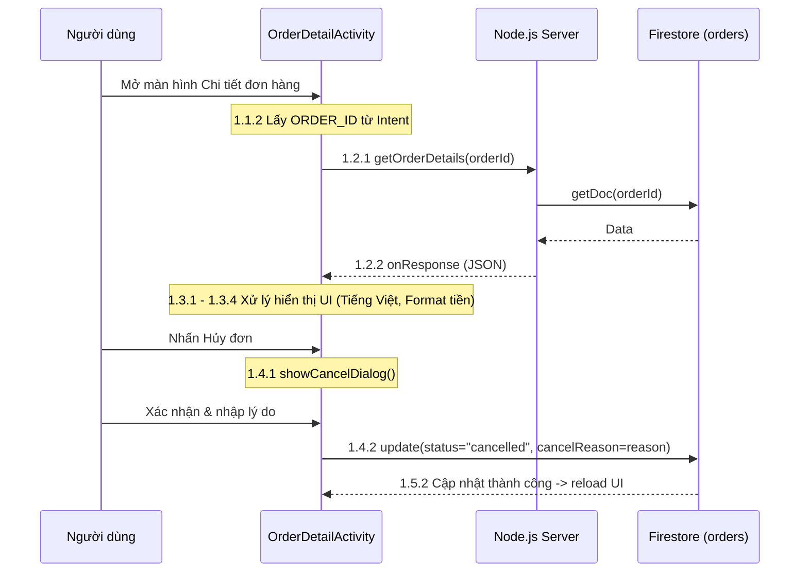
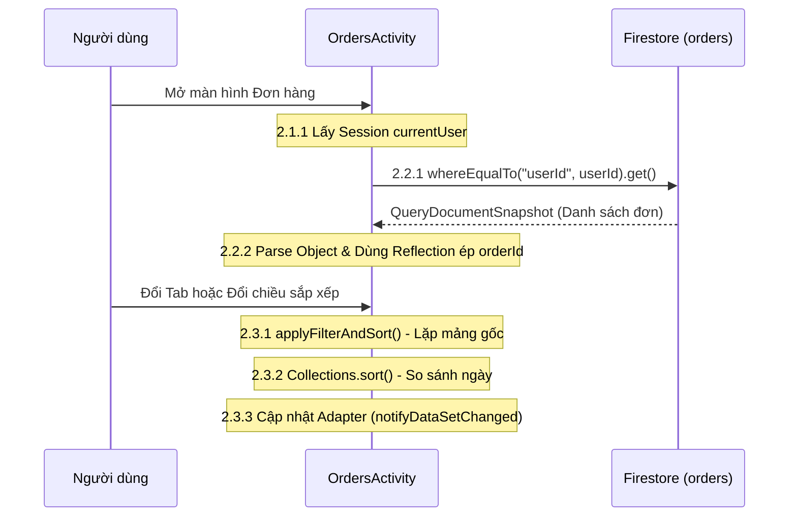
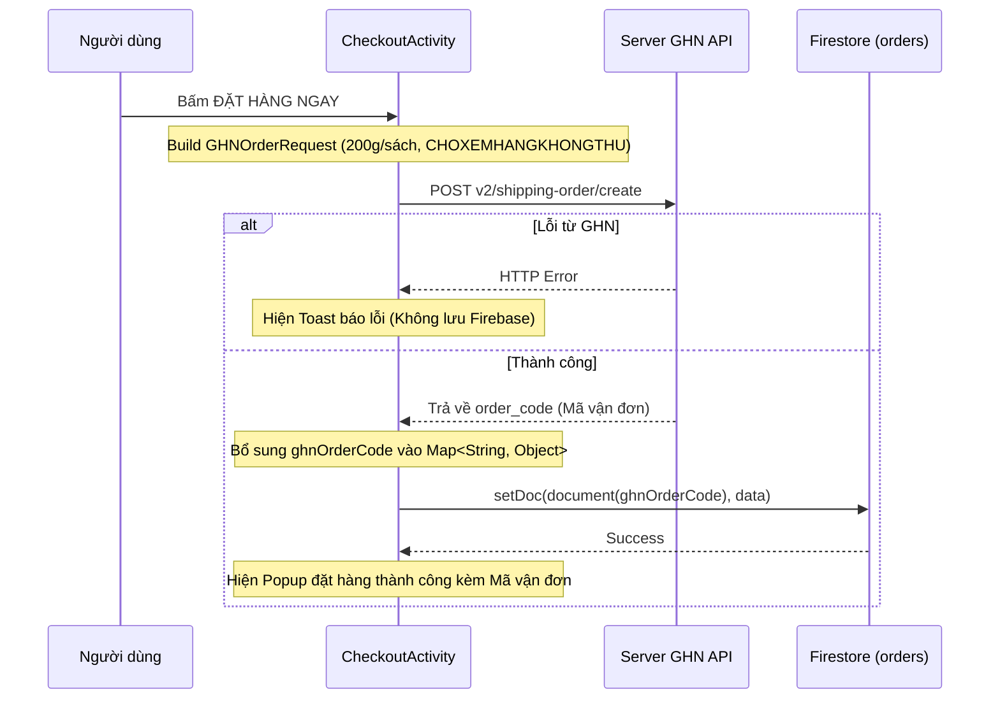
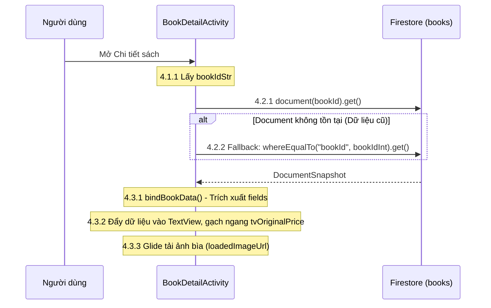
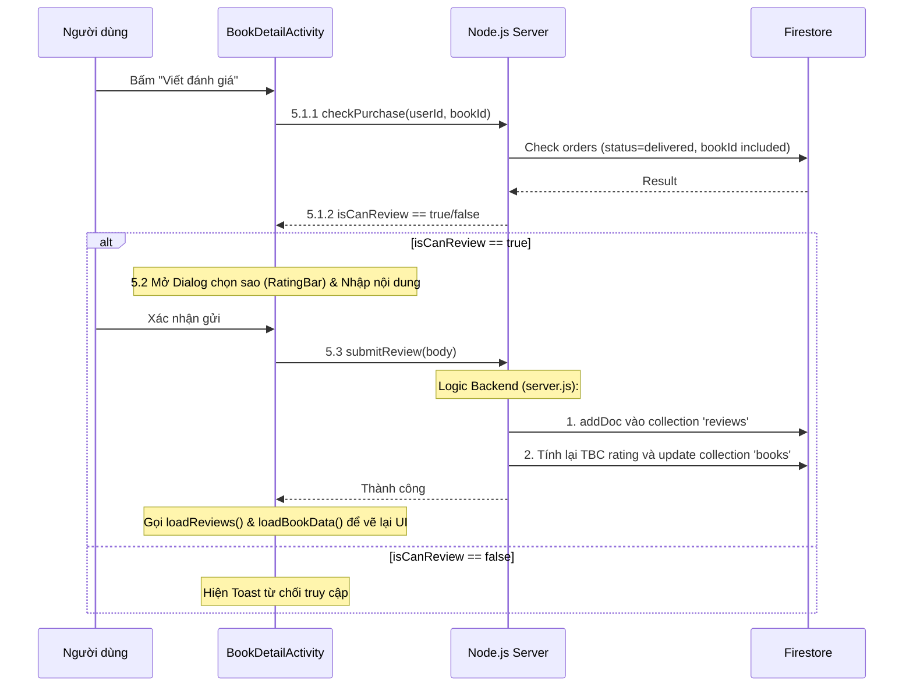
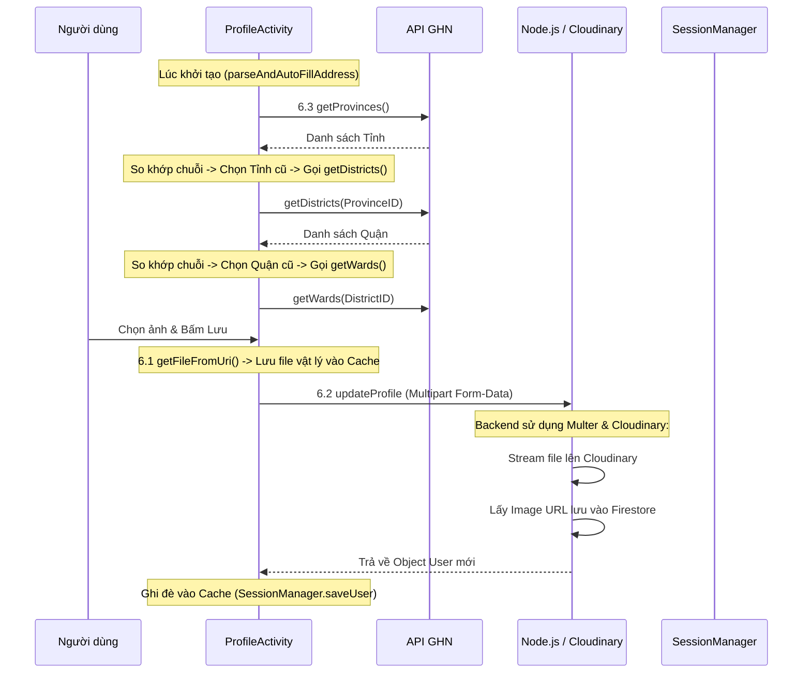

# Tài Liệu Kỹ Thuật: LapTrinhMobile Bookstore (Bản Chi Tiết Bảo Vệ Đồ Án)

Tài liệu này được biên soạn đặc biệt để phục vụ cho buổi bảo vệ đồ án/bài tập lớn. Nội dung tập trung giải thích sâu về **Kiến trúc hệ thống**, **Flow code**, **Vai trò của từng class/hàm cụ thể** ở cả phía Mobile (Android Java) và phía Backend (Node.js/Firebase).

Mỗi chức năng được đánh số theo tiêu chuẩn IEEE. Trong mã nguồn Android, bạn có thể nhấn `Ctrl + F` để tìm mã số (ví dụ: `1.1.1`, `1.2.1`) để đối chiếu code trực tiếp.

---

## KIẾN TRÚC HỆ THỐNG TỔNG QUAN
- **Frontend (Mobile App):** Viết bằng Java thuần trên Android Studio. Sử dụng **Retrofit** để gọi API, **Glide** để load ảnh, và **Firebase Firestore SDK** để truy xuất một số dữ liệu trực tiếp.
- **Backend (Node.js Server):** File `server.js` viết bằng Express.js. Giao tiếp với Firebase qua `firebase/firestore`. Sử dụng thư viện `multer` và `cloudinary` để xử lý upload file ảnh.
- **Bên thứ 3 (Giao Hàng Nhanh - GHN API):** Sử dụng các endpoint `master-data` để lấy danh sách Tỉnh/Huyện/Xã và endpoint `shipping-order/create` để tạo mã vận đơn.

---

## 1. Chi Tiết Đơn Hàng (Order Detail)
- **Tập tin Android:** `app/src/main/java/com/project/bookstoreapp/activity/OrderDetailActivity.java`
- **Tập tin Backend:** `bookstore-backend/server.js` (Endpoint: `GET /api/orders/:orderId`)
- **Vai trò, Ý nghĩa (Thầy hỏi code ở đâu, làm thế nào?):**
  - Khi User click vào một đơn hàng, `Intent` sẽ truyền `ORDER_ID` sang Activity này.
  - Thay vì tự query Firebase trên App, tính năng này được thiết kế gọi qua Backend (Node.js) bằng hàm `apiService.getOrderDetails(orderId)` qua thư viện Retrofit. Điều này giúp Backend có thể kiểm soát và định dạng lại dữ liệu trước khi trả về.
  - Ở Node.js (`server.js`), API gọi hàm `getDoc(doc(db, "orders", orderId))` để lấy dữ liệu từ Firestore và trả về dạng JSON.
  - Ở tính năng **Hủy đơn hàng**, App gọi trực tiếp Firestore SDK (không qua backend) thông qua đoạn mã `FirebaseFirestore.getInstance().collection("orders").document(currentOrderId).update()`. Cập nhật 2 trường `status = "cancelled"` và `cancelReason`. 

### Flow Code (Luồng dữ liệu):
- **1.1 Khởi tạo và thiết lập (`onCreate` & `initViews`):**
  - **1.1.1** Bắt đầu tại hàm `initViews()`, khởi tạo View.
  - **1.1.2** Trong `onCreate()`, lấy `ORDER_ID` từ Intent.
- **1.2 Tải dữ liệu từ backend (`loadOrderDetails`):**
  - **1.2.1** Sử dụng Retrofit gửi HTTP GET.
  - **1.2.2** Xử lý trong `onResponse`, nhận JSON và truyền vào hàm `displayOrderDetails`.
- **1.3 Hiển thị giao diện (`displayOrderDetails`):**
  - **1.3.1** Dịch trường `order.getStatus()` thành tiếng Việt.
  - **1.3.2** Ẩn/hiện nút Hủy Đơn dựa trên trạng thái `pending`.
  - **1.3.3** Format ngày (`SimpleDateFormat`), tiền (`DecimalFormat`).
  - **1.3.4** Làm mới list `itemList` và gọi `adapter.notifyDataSetChanged()`.
- **1.4 Hủy đơn (`showCancelDialog` & `cancelOrder`):**
  - **1.4.1** Mở `AlertDialog` nhập lý do.
  - **1.4.2** Gọi update Firestore.
  - **1.5.2** Lắng nghe kết quả (`addOnSuccessListener`), reload UI.

---

## 2. Quản Lý Đơn Hàng Của Tôi (My Orders)
- **Tập tin Android:** `OrdersActivity.java`, `OrderAdapter.java`
- **Vai trò, Ý nghĩa (Thầy hỏi code ở đâu, làm thế nào?):**
  - Code nằm trong `OrdersActivity`. Đây là nơi user xem lịch sử mua hàng.
  - Chức năng này không dùng Node.js mà **query trực tiếp Firestore** bằng hàm `db.collection("orders").whereEqualTo("userId", userId).get()`. Lấy toàn bộ đơn của user và bỏ vào mảng `originalOrderList`.
  - Tại sao lại load hết rồi mới lọc trên RAM điện thoại (hàm `applyFilterAndSort()`)? Trả lời: Do Firestore giới hạn và tính phí theo số lần đọc (Read Operations). Việc query toàn bộ 1 lần rồi dùng Java (Vòng lặp `for`, lệnh `if` kiểm tra `currentStatusFilter`) để lọc Tab (Chờ xác nhận, Đang giao...) và sắp xếp bằng `Collections.sort()` giúp tối ưu tốc độ UI và giảm chi phí database.

### Flow Code (Luồng dữ liệu):
- **2.1 Khởi tạo (`onCreate`):**
  - **2.1.1** Kiểm tra `SessionManager` để lấy `currentUser`.
  - **2.1.2** `initViews()` - Gắn sự kiện `ChipGroup` (đổi Tab) và `btnSortTime`.
  - **2.1.3** Khởi tạo `OrderAdapter`.
- **2.2 Truy xuất dữ liệu (`loadOrdersFromFirebase`):**
  - **2.2.1** Query `whereEqualTo("userId", userId)`.
  - **2.2.2** Chuyển JSON thành Object `Order`. Dùng `java.lang.reflect.Field` (Reflection) ép ép Document ID của Firebase vào biến `orderId` của object Java.
- **2.3 Lọc và sắp xếp (`applyFilterAndSort`):**
  - **2.3.1** Xóa mảng `orderList`. Lặp qua `originalOrderList` kiểm tra biến trạng thái.
  - **2.3.2** `Collections.sort()` dựa trên chuỗi ngày tháng `CreatedAt` và cờ `isSortDesc`.
  - **2.3.3** Hiện `layoutEmpty` nếu rỗng, nếu có dữ liệu gọi `notifyDataSetChanged()`.

---

## 3. Tạo Đơn Hàng Tích Hợp Giao Hàng Nhanh (GHN)
- **Tập tin Android:** `CheckoutActivity.java`, `GHNApiService.java`, Request DTOs trong package `com.project.bookstoreapp.ghn`.
- **Vai trò, Ý nghĩa (Thầy hỏi code ở đâu, làm thế nào?):**
  - Nằm trong hàm `placeOrder()` của `CheckoutActivity.java`.
  - **Logic tích hợp:** Ứng dụng gom dữ liệu giỏ hàng, tính toán khối lượng tự động (mặc định 200g/cuốn sách) vào biến `totalWeight`. Đóng gói thành object `GHNOrderRequest` với các cấu hình bắt buộc: kích thước gói (20x15x10cm), hình thức thanh toán (Khách trả / Shop trả), và cho phép xem hàng `CHOXEMHANGKHONGTHU`.
  - Ứng dụng sẽ gọi API POST `v2/shipping-order/create` của GHN trước. Nếu GHN khởi tạo đơn thành công, họ trả về một `order_code` (VD: LXZ123).
  - **Điểm ăn tiền:** Ta lấy chính `order_code` này làm Document ID cho Firebase: `db.collection("orders").document(ghnOrderCode).set(order)`. Nhờ vậy, mã vận đơn được đồng bộ hoàn hảo giữa App, Database và hệ thống GHN.

### Flow Code (Luồng dữ liệu):
- **3.1 Chuẩn bị dữ liệu (`placeOrder`):**
  - Tính tổng tiền `subtotal`, phí vận chuyển `dynamicShippingFee`.
  - Khởi tạo mảng `GHNItem` tương ứng với các sách trong giỏ.
- **3.2 Gọi API GHN:**
  - Khởi tạo `GHNOrderRequest`. Gửi qua `RetrofitClientGHN.getApiService().createOrder()`.
- **3.3 Xử lý Response GHN & Lưu Database:**
  - Trong `onResponse`, nếu GHN trả về lỗi 4xx/5xx -> Báo lỗi, không lưu Firebase.
  - Nếu thành công, trích xuất `ghnOrderCode`. Set `order.put("displayId", ghnOrderCode)`.
  - Gọi Firebase: `db.collection("orders").document(ghnOrderCode).set(order)`.
  - Thành công: Hiện AlertDialog kèm hiển thị "Mã vận đơn GHN: XXXXXX".

---

## 4. Chi Tiết Sản Phẩm & Lấy Dữ Liệu Sách
- **Tập tin Android:** `BookDetailActivity.java`
- **Vai trò, Ý nghĩa (Thầy hỏi code ở đâu, làm thế nào?):**
  - File `BookDetailActivity.java` đóng vai trò hiển thị UI. 
  - Đáng chú ý là thuật toán **Fallback Database Retrieval** (Tìm kiếm dự phòng) trong hàm `loadBookData()`. Nếu ID của sách là Document ID kiểu String (do backend mới tạo), Firebase sẽ tìm ra ngay `document(bookId).get()`. Tuy nhiên, nếu sách là data cũ (ID kiểu Long/Int), truy vấn String sẽ lỗi (exists = false). 
  - App tự động bắt lỗi và nhảy sang câu truy vấn phụ: `whereEqualTo("bookId", currentBookIdInt)`. Logic này giúp hệ thống tương thích ngược với Database cũ không cần migration data.

### Flow Code (Luồng dữ liệu):
- **4.1 Nhận ID sách (`onCreate`):**
  - **4.1.1** Lấy `bookIdStr` qua Intent.
  - **4.1.2** Dùng `Integer.parseInt()` tạo biến dự phòng `currentBookIdInt`.
- **4.2 Truy vấn sách (`loadBookData`):**
  - **4.2.1** Query `db.collection("books").document(bookId).get()`.
  - **4.2.2** Fallback nếu `exists==false`: gọi `whereEqualTo("bookId", currentBookIdInt)`.
- **4.3 Hiển thị (`bindBookData`):**
  - **4.3.1** Trích xuất fields (title, author, price...).
  - **4.3.2** Set text, tạo hiệu ứng gạch ngang giá gốc bằng `Paint.STRIKE_THRU_TEXT_FLAG`.
  - **4.3.3** Bất đồng bộ load ảnh qua thư viện Glide.

---

## 5. Đánh Giá Sản Phẩm (Review System)
- **Tập tin Android:** `BookDetailActivity.java` (Các hàm `loadReviews`, `checkPurchaseAndReview`, `showWriteReviewDialog`)
- **Tập tin Backend:** `server.js` (`POST /api/reviews/check-purchase`, `POST /api/reviews`)
- **Vai trò, Ý nghĩa (Thầy hỏi code ở đâu, làm thế nào?):**
  - Chức năng đánh giá nằm ngay trong màn hình Sách.
  - Vấn đề bảo mật: Không phải ai cũng được đánh giá. App không tự quyết định mà gọi về Node.js hàm `/api/reviews/check-purchase`. Node.js quét mảng `orders` của user đó, kiểm tra xem có đơn hàng nào `status === "delivered"` và `bookIds.includes(bookId)` hay không. Nếu có, Node.js trả về `canReview = true`.
  - Khi lưu đánh giá (`/api/reviews`), Backend đóng vai trò như một **Trigger tự động**: Nó lưu bản ghi đánh giá vào bảng `reviews`, sau đó tự động Query sang bảng `books` lấy `reviewCount` và `rating` cũ, tính toán lại giá trị **Trung bình cộng mới**, và lưu đè lại vào sách.

### Flow Code (Luồng dữ liệu):
- **5.1 Kiểm tra mua hàng (`checkPurchaseAndReview`):**
  - **5.1.1** Gọi `apiService.checkPurchase()`. Node.js kiểm tra logic `delivered` và `includes(bookId)`.
  - **5.1.2** Trả về cờ boolean.
- **5.2 Nhập đánh giá (`showWriteReviewDialog`):**
  - Kích hoạt Custom Dialog chứa `RatingBar`. Lấy tên người dùng từ DB làm tác giả.
- **5.3 Gửi đánh giá (`submitReview`):**
  - Gửi body lên `/api/reviews`. Backend Node.js thực thi tính toán.
  - Khi hoàn thành, gọi lại `loadReviews()` và `loadBookData()` để App render lại sao trung bình mới nhất.

---

## 6. Hồ Sơ Người Dùng & API Địa Chỉ Logistic (Profile)
- **Tập tin Android:** `ProfileActivity.java`
- **Tập tin Backend:** `server.js` (`PUT /api/users/profile`)
- **Vai trò, Ý nghĩa (Thầy hỏi code ở đâu, làm thế nào?):**
  - Nằm trong `ProfileActivity.java`. Quản lý thông tin (Tên, SĐT), Ảnh đại diện và Mật khẩu.
  - **Xử lý Ảnh Đại Diện (Multipart Form):** Mobile không đẩy text base64 (sẽ làm phình database và chậm mạng). Android đọc file ảnh bằng `ContentResolver`, ghi ra Cache thành file vật lý, đóng gói thành `MultipartBody.Part`.
  - Node.js sử dụng Middleware `multer` và `multer-storage-cloudinary` để hứng luồng file này. Ảnh được đẩy thẳng từ RAM server lên **Cloudinary** (Dịch vụ lưu trữ ảnh). Cloudinary trả về một link URL (VD: `res.cloudinary.com/image.jpg`). Node.js lấy link này update vào Firestore.
  - **Xử lý GHN API (Khu vực Logistics):** Để địa chỉ giao hàng chuẩn xác, không cho user nhập tay mà dùng `AutoCompleteTextView`. App gọi trực tiếp API `master-data` của Giao Hàng Nhanh. Tính năng **Auto-Fill**: Hàm `parseAndAutoFillAddress` tách chuỗi địa chỉ cũ (split bằng dấu phẩy). Dùng vòng lặp dò tìm chuỗi (`String Matching`) trùng tên Tỉnh/Huyện, tự động giả lập click để gọi API cấp thấp hơn (Tỉnh -> Huyện -> Xã).

### Flow Code (Luồng dữ liệu):
- **6.1 Xử lý ảnh (`setupListeners`, `getFileFromUri`):**
  - Mở thư viện, lấy `Uri`. Gọi `getFileFromUri()` ghi luồng byte ra thư mục Cache để tạo File.
- **6.2 Lưu hồ sơ (`saveProfile`):**
  - Gói text thành RequestBody `text/plain`. File thành `MultipartBody.Part`. Gọi API `/api/users/profile`.
- **6.3 Auto-fill địa chỉ (`loadProvinces`, `loadDistricts`, `loadWards`):**
  - Gọi API GHN với Header Token. Đổ mảng vào Adapter. Nếu biến `targetProvinceName` tồn tại và khớp tên trong mảng, tự động nhảy sang gọi `loadDistricts(ProvinceID)`.

